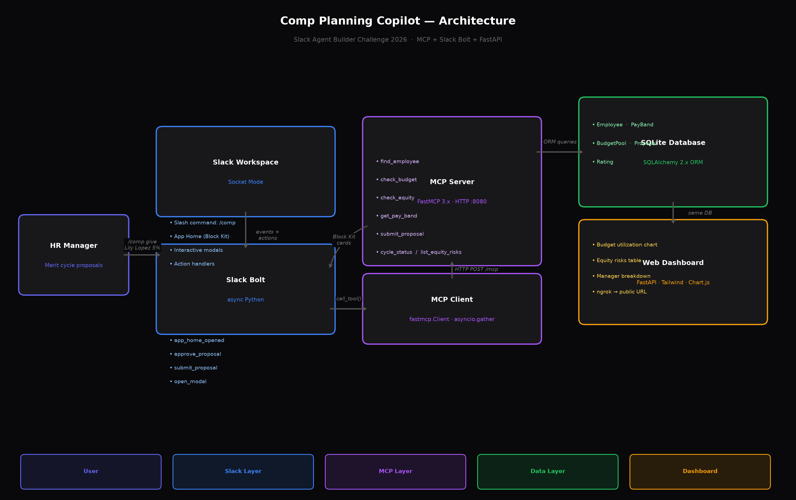

# Comp Planning Copilot

> **No overspend. No pay gaps. No spreadsheets.**

An AI compensation agent that lives in Slack. HR managers propose, review, and approve merit raises without leaving the conversation — while the agent silently enforces budget guardrails and pay equity checks on every submission.

Built for the **[Slack Agent Builder Challenge 2026](https://slackhack.devpost.com)**.



---

## What it does

Every merit raise goes through two automatic checks:

**1. Budget guardrail**
Each manager has a merit pool. Before any raise is approved, the agent checks remaining budget in real time. If the proposal exceeds the pool, it's automatically escalated to HR for exception approval — with the exact overage surfaced.

**2. Pay equity check (EU Pay Transparency Directive 2026)**
Every proposed salary is compared to the peer median — same role, level, and location. If it lands more than 5% below median, the agent flags it, shows the gap in dollars and percentage, and recommends a remediation range to close it.

---

## Demo

| Command | What happens |
|---|---|
| `/comp give Lily Lopez 5%` | Equity flag — 7% below peer median, recommends adjustment |
| `/comp give Andrew Mitchell 8%` | Budget guardrail — pool at 93%, escalated to HR |
| `/comp give David Park 7%` | Clean approval — budget fine, equity fine, pay band fine |
| `/comp status` | Live cycle pulse — utilization, proposals, escalations |

---

## Architecture

```
HR Manager (Slack)
    └── Slash command / App Home / Modal
            └── Slack Bolt async (Socket Mode)
                    └── MCP Client (FastMCP 3.x)
                            └── MCP Server (HTTP :8080)
                                    └── SQLAlchemy + SQLite
                                            └── Web Dashboard (FastAPI + Chart.js)
```

**MCP Server** exposes 7 tools:
- `find_employee` — fuzzy name search with disambiguation
- `check_budget` — pool utilization, remaining headroom, overage
- `check_equity` — peer median calc, % gap, EU directive flag, recommended range
- `get_pay_band` — band min/mid/max with position indicator
- `submit_proposal` — writes proposal, updates budget pool
- `cycle_status` — aggregate cycle metrics across all managers
- `list_equity_risks` — all employees >5% below peer median, sorted by severity

A single `/comp give` command calls `find_employee`, `check_budget`, `check_equity`, and `get_pay_band` **in parallel** via `asyncio.gather`.

---

## Setup

### Prerequisites
- Python 3.11+
- Slack app with Socket Mode enabled ([manifest below](#slack-app-manifest))

### Install

```bash
git clone https://github.com/sainathek1999/comp-planning-copilot
cd comp-planning-copilot
python -m venv .venv
source .venv/bin/activate
pip install -e .
```

### Configure

```bash
cp .env.example .env
# Fill in SLACK_BOT_TOKEN and SLACK_APP_TOKEN
```

### Seed demo data

```bash
python scripts/seed_data.py
```

Seeds 58 employees, 60 pay bands, 6 budget pools, and 17 pre-built proposals with realistic statuses.

**Demo hooks baked in:**
- **Dana Whitfield** — budget at 93.4%, any new raise escalates
- **Lily Lopez** — PM L3 NY, 9.5% below peer median → equity flag
- **Kim Johnson** — SE L4 SF, 11.6% below peer median → equity flag
- **Nina Garcia** — DS L4 Austin, 9.8% below peer median → equity flag
- **Andrew Mitchell / Zoe Perez** — already escalated (Dana's pool exhausted)

### Run

```bash
# Terminal 1 — MCP server
python -m mcp_server.server

# Terminal 2 — Slack bot
python -m slack_agent.app

# Terminal 3 — Web dashboard
python -m dashboard.app
```

Dashboard runs at `http://localhost:3001`. Use [ngrok](https://ngrok.com) to expose it publicly:

```bash
ngrok http 3001
```

Update `DASHBOARD_URL` in `.env` with the ngrok URL.

---

## Slack App Manifest

Create a new Slack app at [api.slack.com/apps](https://api.slack.com/apps) → **From a manifest**:

```yaml
display_information:
  name: Comp Copilot
  description: AI comp agent — budget guardrails + pay equity checks
  background_color: "#09090b"

features:
  app_home:
    home_tab_enabled: true
    messages_tab_enabled: false
  bot_user:
    display_name: Comp Copilot
    always_online: true
  slash_commands:
    - command: /comp
      description: Propose or review a merit raise
      usage_hint: "give <name> <pct>% | status | check <name>"
      should_escape: false

oauth_config:
  scopes:
    bot:
      - app_mentions:read
      - channels:read
      - chat:write
      - commands
      - users:read
      - im:write
      - im:read

settings:
  event_subscriptions:
    bot_events:
      - app_home_opened
      - app_mention
  interactivity:
    is_enabled: true
  socket_mode_enabled: true
  token_rotation_enabled: false
```

---

## Tests

```bash
pytest tests/ -v
```

22 tests covering all MCP tools — comp math, budget logic, equity flags, edge cases.

---

## Tech Stack

| Layer | Tech |
|---|---|
| Slack agent | Slack Bolt async, Socket Mode |
| MCP | FastMCP 3.x, HTTP transport |
| Data | SQLAlchemy 2.x, SQLite |
| Dashboard | FastAPI, Tailwind CSS, Chart.js |
| Tests | pytest, pytest-asyncio |
| Tunnel | ngrok |

---

## Project Structure

```
comp-planning-copilot/
├── mcp_server/
│   ├── server.py          # FastMCP server — 7 tools
│   └── db/
│       └── models.py      # SQLAlchemy models
├── slack_agent/
│   ├── app.py             # Bolt async app — all handlers
│   ├── blocks.py          # Block Kit card builders
│   └── mcp_client.py      # MCP client wrapper
├── dashboard/
│   ├── app.py             # FastAPI dashboard server
│   └── templates/
│       └── index.html     # Dark-theme dashboard UI
├── scripts/
│   └── seed_data.py       # 58 employees + 17 demo proposals
├── tests/
│   └── test_comp_math.py  # 22 tests
├── architecture.png
├── .env.example
└── pyproject.toml
```
